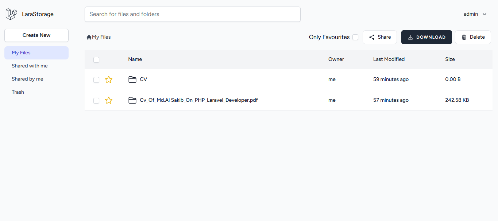
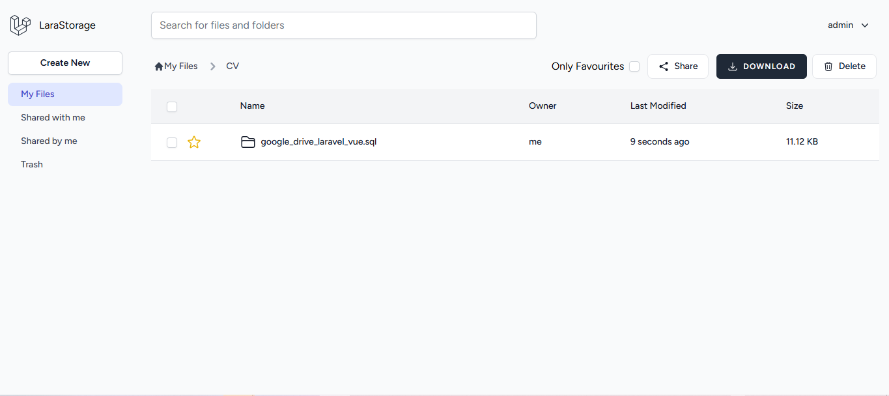
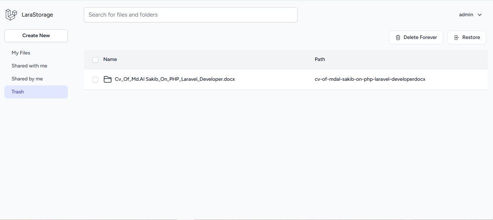
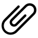

# Google Drive Clone (Laravel + Vue)

A full-stack file management application inspired by Google Drive, built with Laravel 10, Vue 3, Inertia.js, and Tailwind CSS.

This project supports file and folder uploads, nested directories, trash and restore, favorites, sharing by email, and downloads (single or zip). It also includes asynchronous cloud upload support via queue jobs.

## Table Of Contents

1. [Features](#features)
2. [Tech Stack](#tech-stack)
3. [Project Architecture](#project-architecture)
4. [Prerequisites](#prerequisites)
5. [Installation (Local)](#installation-local)
6. [Installation (Docker / Laravel Sail)](#installation-docker--laravel-sail)
7. [Environment Variables](#environment-variables)
8. [Run The Application](#run-the-application)
9. [Queue, Mail, And Cloud Upload Notes](#queue-mail-and-cloud-upload-notes)
10. [Main Routes](#main-routes)
11. [Project Images](#project-images)
12. [Testing](#testing)
13. [Troubleshooting](#troubleshooting)
14. [License](#license)

## Features

- Authentication and profile management (Laravel Breeze + Inertia)
- Personal root storage per user
- File and folder upload support
- Nested folder tree structure using `kalnoy/nestedset`
- Duplicate prevention for files/folders in the same directory
- Search within file listings
- Soft delete to trash
- Restore from trash
- Permanent delete from trash
- Favorites (starred files)
- Share files/folders by email with notifications
- Shared with me / shared by me views
- Download single file or batch download as zip
- Optional cloud upload flow (S3 disk) via queued job

## Tech Stack

- Backend: Laravel 10, PHP 8.1+
- Frontend: Vue 3, Inertia.js, Tailwind CSS, Vite
- Database: MySQL 8
- Queue: Laravel Queue (`sync`, `database`, `redis`, etc.)
- Storage: Local disk and S3-compatible cloud disk
- Mail: SMTP (Mailpit-ready for local Docker setup)

## Project Architecture

- `app/Http/Controllers/FileController.php`: core file/folder logic
- `app/Models/File.php`: file tree model, ownership, sharing scopes, soft deletes
- `app/Jobs/UploadFileToCloudJob.php`: async cloud upload job
- `app/Mail/ShareFilesMail.php`: sharing notification email
- `resources/js/Pages/`: Inertia Vue pages (`MyFiles`, `Trash`, `SharedWithMe`, etc.)
- `routes/web.php`: authenticated web routes for all file operations

## Prerequisites

- PHP `>= 8.1`
- Composer
- Node.js `>= 18` and npm
- MySQL `>= 8`

Optional:

- Redis (if using `QUEUE_CONNECTION=redis`)
- AWS S3 or S3-compatible storage (for cloud upload)
- Docker Desktop (for Sail workflow)

## Installation (Local)

1. Clone repository:

```bash
git clone https://github.com/alsakib748/Google-Drive-Laravel-Vue.git
cd Google-Drive-Laravel-Vue
```

2. Install backend dependencies:

```bash
composer install
```

3. Install frontend dependencies:

```bash
npm install
```

4. Configure environment:

```bash
cp .env.example .env
php artisan key:generate
```

5. Update `.env` database credentials, then run migrations:

```bash
php artisan migrate
```

6. Create storage symlink:

```bash
php artisan storage:link
```

7. Start development servers (in separate terminals):

```bash
php artisan serve
```

```bash
npm run dev
```

Open `http://127.0.0.1:8000`.

## Installation (Docker / Laravel Sail)

1. Install dependencies:

```bash
composer install
npm install
```

2. Prepare environment:

```bash
cp .env.example .env
php artisan key:generate
```

3. Start containers:

```bash
./vendor/bin/sail up -d
```

4. Run setup inside Sail:

```bash
./vendor/bin/sail artisan migrate
./vendor/bin/sail artisan storage:link
```

5. Run frontend watcher:

```bash
./vendor/bin/sail npm run dev
```

Default services in `docker-compose.yml` include `mysql`, `redis`, `mailpit`, `meilisearch`, and `selenium`.

## Environment Variables

Minimum variables to review in `.env`:

```env
APP_NAME="Google Drive Clone"
APP_ENV=local
APP_DEBUG=true
APP_URL=http://localhost

DB_CONNECTION=mysql
DB_HOST=mysql
DB_PORT=3306
DB_DATABASE=laravel_file_manager
DB_USERNAME=root
DB_PASSWORD=

FILESYSTEM_DISK=local
QUEUE_CONNECTION=sync

MAIL_MAILER=smtp
MAIL_HOST=mailpit
MAIL_PORT=1025
MAIL_FROM_ADDRESS="hello@example.com"
MAIL_FROM_NAME="${APP_NAME}"

AWS_ACCESS_KEY_ID=
AWS_SECRET_ACCESS_KEY=
AWS_DEFAULT_REGION=us-east-1
AWS_BUCKET=
AWS_USE_PATH_STYLE_ENDPOINT=false
```

## Run The Application

Development:

```bash
php artisan serve
npm run dev
```

Production asset build:

```bash
npm run build
```

## Queue, Mail, And Cloud Upload Notes

- Uploaded files are first stored locally.
- `UploadFileToCloudJob` then attempts to upload to the configured cloud disk.
- With `QUEUE_CONNECTION=sync`, upload runs immediately in-request.
- For async background processing, set `QUEUE_CONNECTION=database` (or `redis`) and run:

```bash
php artisan queue:work
```

- Sharing triggers email notifications via `ShareFilesMail`. In Docker dev, Mailpit dashboard is exposed on port `8025` by default.

## Main Routes

Authenticated file manager routes (see `routes/web.php`):

- `GET /my-files/{folder?}`: browse files
- `GET /trash`: view trashed items
- `POST /folder/create`: create folder
- `POST /file`: upload files
- `DELETE /file`: move to trash
- `POST /file/restore`: restore trashed items
- `DELETE /file/delete-forever`: permanently delete
- `POST /file/add-to-favourites`: toggle favorite
- `POST /file/share`: share items by email
- `GET /shared-with-me`: items shared with current user
- `GET /shared-by-me`: items shared by current user
- `GET /file/download`: download selected items
- `GET /file/download-shared-with-me`: download shared-with-me items
- `GET /file/download-shared-by-me`: download shared-by-me items

## Project Images

<div align="center">
	<h3>Application Screenshots</h3>
	<p><em>Main file manager views from the Laravel + Vue app</em></p>
</div>

<div class="py-1">
   <b>Home</b><br/>
	<a href="screenshots/home.png">
				
	</a>
</div>

<div class="py-1">
   <b>Inside Folder</b><br/>
			<a href="screenshots/home_inside_folder.png">
				
			</a>
</div>

<div class="py-1">
   <b>Trash</b><br/>
		<a href="screenshots/trash.png">
			
	    </a>
</div>

### File Type Icons

Current repository image assets (file-type icons):

| Icon | Preview |
|---|---|
| Attach File |  |
| Audio |  |
| Excel |  |
| Image |  |
| PDF |  |
| Text File |  |
| Video |  |
| Word |  |
| ZIP |  |

## Testing

Run PHP tests:

```bash
php artisan test
```

Or with Sail:

```bash
./vendor/bin/sail test
```

## Troubleshooting

- `SQLSTATE[HY000] [2002]`: verify `DB_HOST`, port, and container/db service health.
- Missing uploaded file links: run `php artisan storage:link`.
- Share email not sent locally: ensure `MAIL_HOST`, `MAIL_PORT`, and mail service are correct.
- Queue jobs not processing: run `php artisan queue:work` when using async queue drivers.
- Frontend changes not reflecting: restart `npm run dev` and clear cache:

```bash
php artisan optimize:clear
```

## License

This project is open-sourced software licensed under the [MIT license](https://opensource.org/licenses/MIT).
